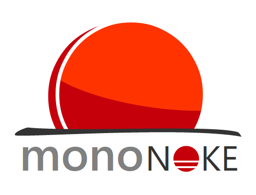

  

  
  
  

# Mononoke

Mononoke is a game engine based on the MonoGame framework.

It's in very early stages, and it's built with learning and experimentation purposes. The objective of the project is to create a fully functional game engine, which can be used to develop a commercial game.

> If you are interested in the project, feel free to contact me to join the development!

## Features

As mentioned above, the Mononoke Engine is in very early development. Right now, it has few features implemented -with more to come. Some of the already existent functionality is the following:

- Scene-based engine
- Entity-Component structure
- Simple collision system
- Full control of the game for the programmer

 

## Short term goals

In short term, the objective of the project is to create an engine capable of building a commertial game. These are the most important  features planned for the Mononoke project:

- Scene management
- Input handling module
- Pathfinding
- Coroutine creation and management
- Particle system
- Audio management
- User interface
- Entity Component System

 

## Long term goals

In long term, the Mononoke Engine will grow with more functionality and quality-of-live improvements. These tools are quite important for the Mononoke project, since it has learning purposes. Some examples are listed below:

- Documentation and examples
- In-game editing tools
- Remote debugging via HTML / TCP
- Multi-threading
  
